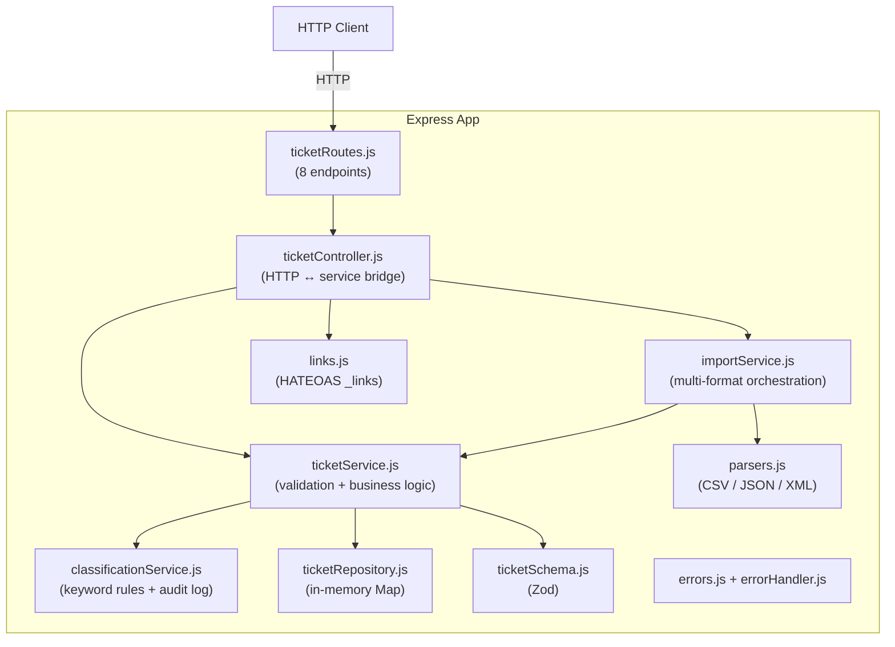

# 🎧 Homework 2: Intelligent Customer Support System

> **Student Name**: Denys Kubrakov
> **Author**: Denys Kubrakov &lt;dkbeetroot@gmail.com&gt;
> **Date Submitted**: 2026-07-06
> **AI Tools Used**: Claude Code (Claude Opus 4.8 & Claude Sonnet 4.6)

---

## 📋 Project Overview

A customer-support ticket management system that imports tickets from multiple file formats, automatically categorizes issues and assigns priorities, and exposes a web front-end for agents to manage tickets day to day. Built end-to-end with the **Context-Model-Prompt** framework using different AI models per task, with AI-generated tests (>85% coverage) and multi-level documentation.

**Stack:** Node.js / Express (backend) · Vue 3 + Vite + Tailwind (frontend) · Jest + Supertest (tests)

**At a glance:** 8 REST endpoints · 3 import formats · rule-based classifier · **126 tests, all green** · **97.8% coverage** · 4 Mermaid diagrams · responsive Vue 3 dashboard

---

## 🧱 Architecture



**Layers:** routes → controller → service → repository. HTTP, business logic, and storage are fully decoupled — the in-memory repository can be swapped for a database by changing one file.

---

## 🚀 Setup & Run

### Prerequisites

- Node.js ≥ 20, npm ≥ 9

### 1 — Backend API

```bash
npm install
npm start              # production: http://localhost:3000
npm run dev            # development: auto-restarts on save
```

Verify:
```bash
curl http://localhost:3000/health
# {"status":"ok"}
```

### 2 — Tests & coverage

```bash
npm test -- --forceExit                  # run all 126 tests
npm run test:coverage -- --forceExit     # coverage report (85% threshold enforced)
```

Coverage output: terminal table + HTML at `coverage/lcov-report/index.html`.

### 3 — Front-end dashboard

```bash
cd frontend
npm install
npm run dev            # http://localhost:5173  (backend must be running)
npm run build          # production build → dist/
```

The Vite dev server proxies `/api/*` → `http://localhost:3000` — no CORS setup needed.

**Base URL** is configurable via `frontend/.env`:
```
VITE_API_BASE_URL=/api   # dev proxy (default)
# VITE_API_BASE_URL=https://api.example.com  # deployed backend
```

---

## 🗂️ Project Structure

```
homework-2/
├── README.md                       # this file
├── package.json                    # API + test scripts; author; jest config
├── src/
│   ├── server.js                   # entry point — starts Express on PORT
│   ├── app.js                      # app factory (imported by tests)
│   ├── routes/
│   │   └── ticketRoutes.js         # 8 route definitions
│   ├── controllers/
│   │   └── ticketController.js     # HTTP ↔ service mapping + _links
│   ├── services/
│   │   ├── ticketService.js        # ticket CRUD + auto-classify integration
│   │   ├── importService.js        # bulk import orchestration
│   │   └── classificationService.js  # keyword rules, confidence, audit log
│   ├── repository/
│   │   └── ticketRepository.js     # in-memory Map store (DB-swappable)
│   ├── schemas/
│   │   └── ticketSchema.js         # Zod create/update schemas + enums
│   ├── middleware/
│   │   └── errorHandler.js         # AppError → HTTP status mapping
│   └── utils/
│       ├── asyncHandler.js         # async route wrapper
│       ├── errors.js               # AppError, NotFoundError, ValidationError, BadRequestError
│       ├── links.js                # HATEOAS _links builders
│       └── parsers.js              # CSV / JSON / XML parsers + format detection
├── tests/
│   ├── fixtures/                   # sample & invalid data for import tests
│   │   ├── sample_tickets.csv      # 50 valid tickets
│   │   ├── sample_tickets.json     # 20 valid tickets
│   │   ├── sample_tickets.xml      # 30 valid tickets
│   │   ├── invalid_bad_email.csv
│   │   ├── invalid_all_wrong.csv
│   │   ├── invalid_malformed.json
│   │   └── invalid_wrong_structure.xml
│   ├── test_ticket_api.test.js     # all 8 endpoints + HATEOAS (30 tests)
│   ├── test_ticket_model.test.js   # Zod schema validation (17 tests)
│   ├── test_import_csv.test.js     # CSV import (7 tests)
│   ├── test_import_json.test.js    # JSON import (6 tests)
│   ├── test_import_xml.test.js     # XML import (6 tests)
│   ├── test_categorization.test.js # classification rules + confidence (23 tests)
│   ├── test_integration.test.js    # end-to-end workflows (5 tests)
│   ├── test_performance.test.js    # benchmark suite (5 tests)
│   └── test_utils_and_errors.test.js # middleware + parsers + error classes (27 tests)
├── frontend/
│   ├── README.md                   # frontend-specific setup
│   ├── src/
│   │   ├── App.vue                 # layout + view orchestration
│   │   ├── composables/
│   │   │   └── useTickets.js       # axios API layer
│   │   └── components/
│   │       ├── TicketList.vue
│   │       ├── TicketFilters.vue
│   │       ├── TicketDetail.vue
│   │       ├── CreateTicketForm.vue
│   │       ├── ImportPanel.vue
│   │       └── BadgePill.vue
│   └── package.json
└── docs/
    ├── API_REFERENCE.md            # all endpoints, schemas, cURL examples
    ├── ARCHITECTURE.md             # component descriptions, sequence diagrams, design decisions
    ├── TESTING_GUIDE.md            # test pyramid, manual checklist, benchmarks
    └── screenshots/
        ├── test_coverage.png       # coverage report (>85%)
        └── ui.png                  # front-end dashboard
```

---

## 📡 API Endpoints

| Method | Endpoint | Description |
|---|---|---|
| `GET` | `/health` | Health check |
| `POST` | `/tickets` | Create ticket (`?auto_classify=true` to classify on creation) |
| `GET` | `/tickets` | List all tickets (filter by `category`, `priority`, `status`, `assigned_to`) |
| `GET` | `/tickets/:id` | Get ticket by ID |
| `PUT` | `/tickets/:id` | Update ticket (setting `category`/`priority` sets `manually_overridden: true`) |
| `DELETE` | `/tickets/:id` | Delete ticket |
| `POST` | `/tickets/import` | Bulk import CSV / JSON / XML (max 5 MB) |
| `POST` | `/tickets/:id/auto-classify` | Run classifier → `{ category, priority, confidence, reasoning, keywords_found }` |
| `GET` | `/tickets/:id/classification-log` | Full decision history for a ticket |

All responses include `_links` (HATEOAS — Richardson Maturity Level 3).

---

## 🎫 Ticket Model

```json
{
  "id": "UUID (server-generated)",
  "customer_id": "string (required)",
  "customer_email": "valid email (required)",
  "customer_name": "string (required)",
  "subject": "string 1–200 chars (required)",
  "description": "string 10–2000 chars (required)",
  "category": "account_access | technical_issue | billing_question | feature_request | bug_report | other",
  "priority": "urgent | high | medium | low",
  "status": "new | in_progress | waiting_customer | resolved | closed",
  "assigned_to": "string | null",
  "tags": ["string"],
  "metadata": {
    "source": "web_form | email | api | chat | phone",
    "browser": "string",
    "device_type": "desktop | mobile | tablet"
  },
  "resolved_at": "ISO 8601 | null",
  "classification_confidence": "number 0–1 | null",
  "manually_overridden": "boolean",
  "created_at": "ISO 8601",
  "updated_at": "ISO 8601",
  "_links": { "self": {}, "update": {}, "delete": {}, "auto_classify": {}, "classification_log": {} }
}
```

---

## 🤖 Auto-Classification

Rule-based keyword scanner in `src/services/classificationService.js`. All rules live in `CLASSIFICATION_CONFIG` — add keywords without touching the algorithm.

**Category keywords:**

| Category | Keywords |
|---|---|
| `account_access` | login, password, sign in, 2fa, locked out |
| `technical_issue` | error, crash, not working, broken, exception |
| `billing_question` | payment, invoice, refund, charge, subscription |
| `feature_request` | please add, would be nice, suggestion, enhancement |
| `bug_report` | bug, reproduce, steps, unexpected behavior |
| `other` | fallback when nothing matches |

**Priority keywords:**

| Priority | Keywords |
|---|---|
| `urgent` | can't access, critical, production down, security |
| `high` | important, blocking, asap |
| `low` | minor, cosmetic, suggestion |
| `medium` | default (no keywords matched) |

**Confidence formula:**
```
category_score = matched_keywords_in_winning_category / keywords_in_that_category
priority_score = 1 if any priority keyword matched, else 0
confidence     = (category_score × 0.7) + (priority_score × 0.3)
```
Range: 0 (no signals) → 1 (all signals matched). Every classification is logged and retrievable via `/tickets/:id/classification-log`.

---

## 🧪 Test Suite

| File | Tests | What it covers |
|---|---|---|
| `test_ticket_api.test.js` | 30 | All 8 endpoints, HATEOAS, `?auto_classify`, override, log |
| `test_ticket_model.test.js` | 17 | Zod schema — required fields, email, lengths, all enums |
| `test_import_csv.test.js` | 7 | 50-row import, partial failures, bad email, no file |
| `test_import_json.test.js` | 6 | Array + wrapper format, malformed, wrong structure |
| `test_import_xml.test.js` | 6 | 30-ticket XML, single-node, wrong root, partial failure |
| `test_categorization.test.js` | 23 | All categories, 4 priorities, confidence formula, case-insensitivity |
| `test_integration.test.js` | 5 | Full lifecycle, bulk import + classify, 25 concurrent requests, filtering |
| `test_performance.test.js` | 5 | Create latency, import throughput, filter latency, classify throughput, concurrency stress |
| `test_utils_and_errors.test.js` | 27 | Error classes, middleware, parsers, edge cases |

**Coverage:**

| Metric | Result | Threshold |
|---|---|---|
| Statements | **97.81%** | 85% |
| Branches | **87.12%** | 85% |
| Functions | **98.43%** | 85% |
| Lines | **97.61%** | 85% |

---

## 🖥️ Front-End Features

| Feature | Component |
|---|---|
| Ticket list with category/priority/status filters | `TicketList.vue` + `TicketFilters.vue` |
| Create form with auto-classify toggle | `CreateTicketForm.vue` |
| Detail view: classification, confidence bar, reasoning, keywords, decision log | `TicketDetail.vue` |
| Manual override (category/priority/status) | `TicketDetail.vue` |
| Bulk import (CSV/JSON/XML) + import summary | `ImportPanel.vue` |

---

## 🧠 Context · Model · Prompt

| Task | Model | Rationale |
|---|---|---|
| 1 · Import API | `claude-opus-4-8` | Multi-file architecture + validation logic |
| 2 · Auto-Classification | `claude-opus-4-8` | Deterministic rule design and edge-case reasoning |
| 3 · Test Suite | `claude-sonnet-4-6` | High-volume test generation |
| 4 · Documentation | Opus (README, ARCHITECTURE) · Sonnet (API_REFERENCE, TESTING_GUIDE) | Assignment requires different model per doc type |
| 5 · Front-End | `claude-opus-4-8` | Cohesive multi-component Vue app |
| 6 · Integration & Perf | `claude-sonnet-4-6` | Multi-step workflows + async concurrency |

---

## 📚 Additional Documentation

| Doc | Audience |
|---|---|
| [`docs/API_REFERENCE.md`](docs/API_REFERENCE.md) | API consumers — every endpoint, full request/response examples, cURL |
| [`docs/ARCHITECTURE.md`](docs/ARCHITECTURE.md) | Technical leads — components, sequence diagrams, design decisions, security |
| [`docs/TESTING_GUIDE.md`](docs/TESTING_GUIDE.md) | QA engineers — test pyramid, manual checklist, benchmarks |

Screenshots: [`docs/screenshots/test_coverage.png`](docs/screenshots/test_coverage.png) · [`docs/screenshots/ui.png`](docs/screenshots/ui.png)

---

<div align="center">

*This project was completed as part of the AI-Assisted Development course.*

</div>
