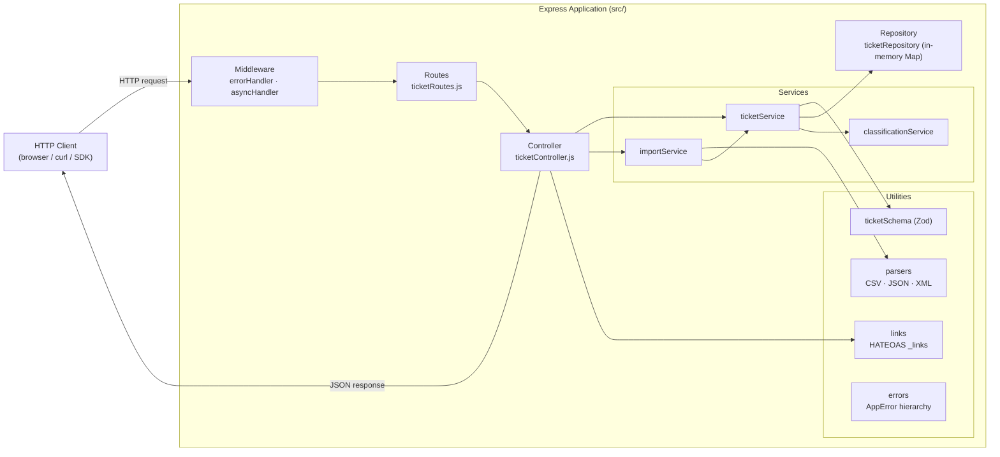
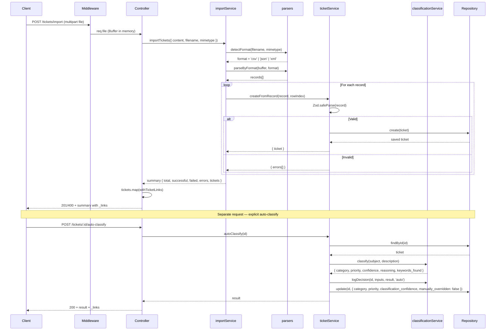

# Architecture

## High-level component diagram



---

## Component descriptions

### Routes (`src/routes/ticketRoutes.js`)

Registers the eight HTTP endpoints. The only logic here is multer's file-upload middleware wired to the import route; everything else is a direct pass-through to the controller wrapped in `asyncHandler` to forward thrown errors to Express's error pipeline.

### Controller (`src/controllers/ticketController.js`)

The HTTP translation layer. It reads from `req`, delegates to a service, then attaches `_links` and calls `res.json()`. No business logic lives here — the controller is kept thin so it can be replaced (e.g. swapped for a GraphQL resolver) without touching the services.

### ticketService (`src/services/ticketService.js`)

Owns all ticket-level business logic:
- Validates input with Zod (`createTicketSchema` / `updateTicketSchema`)
- Builds full ticket entities (server-managed fields: `id`, `created_at`, `updated_at`, `resolved_at`)
- Tracks `manually_overridden` when `PUT` changes category or priority
- Delegates to `classificationService` for auto-classify and log retrieval
- Delegates to `ticketRepository` for persistence

### importService (`src/services/importService.js`)

Orchestrates bulk import: detects format → parses → calls `ticketService.createFromRecord` per row. Collects partial failures without aborting the batch. Returns an import summary.

### classificationService (`src/services/classificationService.js`)

Pure rule-based classifier. The `CLASSIFICATION_CONFIG` object is the only place keywords live — extend it without touching the algorithm.

**Confidence formula:**

```
category_score = matched_in_winning_category / total_in_that_category
priority_score = 1 if any priority keyword matched, else 0
confidence     = (category_score × 0.7) + (priority_score × 0.3)
```

Maintains a module-level in-memory array `decisionLog` holding every classification event.

### Repository (`src/repository/ticketRepository.js`)

A JavaScript `Map` wrapped behind a repository interface (`create`, `findById`, `findAll`, `update`, `delete`, `clear`). The interface is intentional: swap the Map for a database client by changing only this file.

### Schemas (`src/schemas/ticketSchema.js`)

Zod schemas for create and update. All enum constants (`CATEGORIES`, `PRIORITIES`, `STATUSES`, `SOURCES`, `DEVICE_TYPES`) are exported so both the service and tests can reference the same source of truth.

### Error hierarchy (`src/utils/errors.js`)

```
AppError (base, statusCode, details)
├── NotFoundError    → 404
├── ValidationError  → 422  (includes details[])
└── BadRequestError  → 400
```

The `errorHandler` middleware maps these to HTTP responses. Multer's own `MulterError` is caught separately and maps to 400.

---

## Data-flow: bulk import + auto-classify



---

## Design decisions & trade-offs

### In-memory storage

**Decision:** `ticketRepository` uses a `Map`.  
**Trade-off:** Zero setup, instant tests, zero persistence across restarts. Acceptable for this stage; the repository interface means a database can be plugged in by changing one file.

### ESM-only codebase

**Decision:** `"type": "module"` throughout.  
**Trade-off:** Requires `NODE_OPTIONS=--experimental-vm-modules` for Jest. Gains: native `import/export`, no transpile step, better tree-shaking.

### Rule-based classifier (no ML)

**Decision:** Keyword scanning with a config object rather than an external NLP/ML service.  
**Trade-off:** Deterministic, zero latency, zero cost, testable. Missing: handles only known keywords, no synonym expansion, no language variants. Adding an ML layer later would replace `classify()` alone.

### HATEOAS Level 3

**Decision:** Every response embeds `_links`.  
**Trade-off:** Response payload grows ~200 bytes per ticket. Gain: clients decouple from URL structure; the entire API surface is discoverable from `/tickets` alone.

### Partial-success import (not all-or-nothing)

**Decision:** `importService` saves valid rows and reports failures separately.  
**Trade-off:** A batch with one bad row still imports 49 good ones. Callers must check `failed > 0` to handle errors.

### Classification log scoped by ticket ID

**Decision:** The log is an in-memory array filtered at read-time.  
**Trade-off:** O(n) scan on large logs. Acceptable while the log is in memory; production would index by `ticket_id` in a database.

---

## Security considerations

| Concern | Current handling |
|---|---|
| Input validation | Zod schemas on every write endpoint — unknown fields are stripped |
| File uploads | Multer enforces 5 MB limit; files kept in memory, never written to disk |
| Injection | No SQL or shell execution; no user input interpolated into commands |
| CORS | Not configured — add `cors` middleware before shipping to a browser origin |
| Authentication | None — add bearer token / API key middleware at the route level |
| Rate limiting | None — add `express-rate-limit` before production |

## Performance considerations

| Concern | Current state |
|---|---|
| Repository scan | `findAll` iterates the full Map; acceptable at O(n) for < ~100 k tickets |
| Classification log scan | Linear scan per `getDecisionLog` call; add a `Map<ticketId, entry[]>` index if needed |
| Bulk import | Synchronous per-row Zod parse; for very large files, stream the parse and batch the inserts |
| File size | 5 MB in-memory buffer per upload; increase limit if large XML imports are needed |
