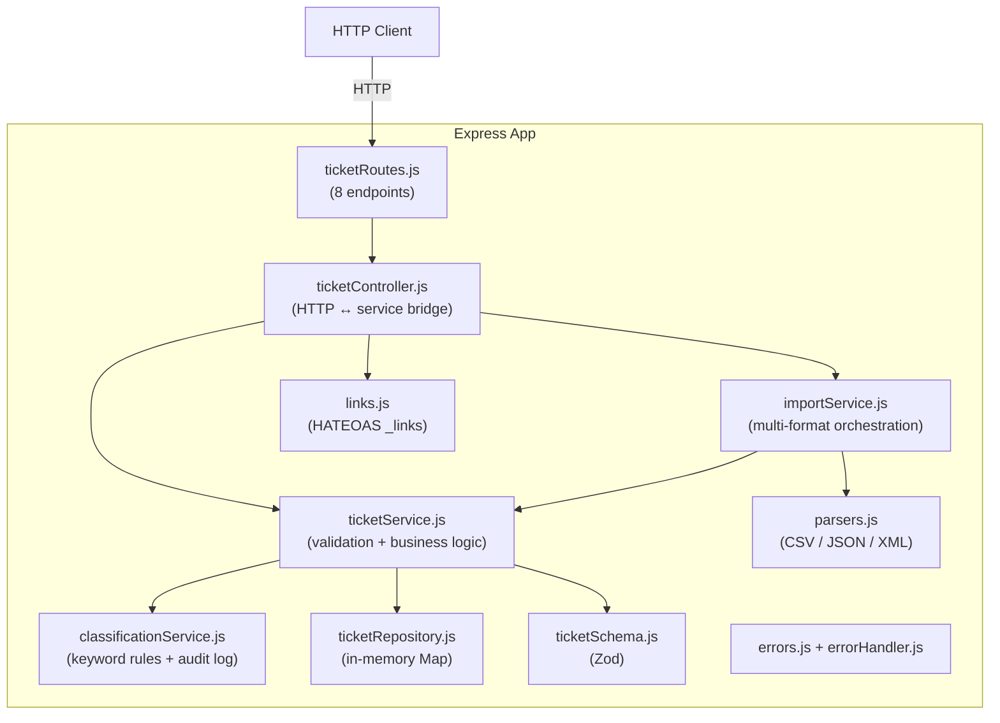

# Intelligent Customer Support System

A production-ready REST API for managing customer support tickets — with multi-format bulk import, rule-based auto-classification, HATEOAS hypermedia links, and a comprehensive Jest test suite.

---

## Features

- **Full CRUD** for support tickets with Zod schema validation
- **Bulk import** from CSV, JSON, and XML (partial-success semantics — valid rows saved even when others fail)
- **Rule-based auto-classification** assigns category + priority from keyword scanning with a documented confidence score
- **HATEOAS — Richardson Level 3** every response carries `_links` so clients navigate without hardcoded URLs
- **Classification audit log** every auto-classify and manual override is logged per ticket
- **Manual override protection** `PUT` changes to category/priority are flagged with `manually_overridden: true`

---

## Architecture overview



---

## Prerequisites

- **Node.js** ≥ 20.x
- **npm** ≥ 9.x

---

## Installation & setup

```bash
# 1. Clone the repo
git clone <repo-url>
cd homework-2

# 2. Install dependencies
npm install

# 3. Start the development server (auto-restarts on file save)
npm run dev

# 4. Or start in production mode
npm start
```

The server listens on **`http://localhost:3000`** by default.  
Set the `PORT` environment variable to override:

```bash
PORT=4000 npm start
```

Verify it's up:

```bash
curl http://localhost:3000/health
# {"status":"ok"}
```

---

## Running tests

```bash
# Run all tests
npm test -- --forceExit

# Run with coverage report (enforces 85% threshold on all metrics)
npm run test:coverage -- --forceExit
```

Coverage output goes to `coverage/` (HTML report at `coverage/lcov-report/index.html`).

---

## Project structure

```
homework-2/
├── src/
│   ├── server.js                  # Entry point — starts Express on PORT
│   ├── app.js                     # App factory (imported by tests too)
│   ├── routes/
│   │   └── ticketRoutes.js        # All 8 route definitions
│   ├── controllers/
│   │   └── ticketController.js    # HTTP ↔ service mapping + _links
│   ├── services/
│   │   ├── ticketService.js       # Ticket CRUD + auto-classify integration
│   │   ├── importService.js       # Bulk import orchestration
│   │   └── classificationService.js  # Keyword rules, confidence, audit log
│   ├── repository/
│   │   └── ticketRepository.js    # In-memory Map store
│   ├── schemas/
│   │   └── ticketSchema.js        # Zod create/update schemas + enums
│   ├── middleware/
│   │   └── errorHandler.js        # Centralized error → HTTP mapping
│   └── utils/
│       ├── asyncHandler.js        # Async route wrapper
│       ├── errors.js              # AppError, NotFoundError, ValidationError, BadRequestError
│       ├── links.js               # HATEOAS _links builders
│       └── parsers.js             # CSV / JSON / XML parsers + format detection
├── tests/
│   ├── fixtures/                  # Sample data for import tests
│   │   ├── sample_tickets.csv     # 50 valid rows
│   │   ├── sample_tickets.json    # 20 tickets
│   │   ├── sample_tickets.xml     # 30 tickets
│   │   ├── invalid_bad_email.csv
│   │   ├── invalid_all_wrong.csv
│   │   ├── invalid_malformed.json
│   │   └── invalid_wrong_structure.xml
│   ├── test_ticket_api.test.js
│   ├── test_ticket_model.test.js
│   ├── test_import_csv.test.js
│   ├── test_import_json.test.js
│   ├── test_import_xml.test.js
│   ├── test_categorization.test.js
│   └── test_utils_and_errors.test.js
├── docs/
│   ├── README.md                  # This file
│   ├── API_REFERENCE.md
│   ├── ARCHITECTURE.md
│   └── TESTING_GUIDE.md
└── package.json
```

---

## Key dependencies

| Package | Version | Purpose |
|---|---|---|
| `express` | ^4.19.2 | HTTP framework |
| `zod` | ^3.23.8 | Schema validation |
| `uuid` | ^10.0.0 | Ticket ID generation |
| `csv-parse` | ^5.5.6 | CSV parsing |
| `fast-xml-parser` | ^4.4.1 | XML parsing |
| `multer` | ^1.4.5-lts.1 | Multipart file uploads |
| `jest` | ^30 | Test runner |
| `supertest` | ^7 | HTTP integration testing |
