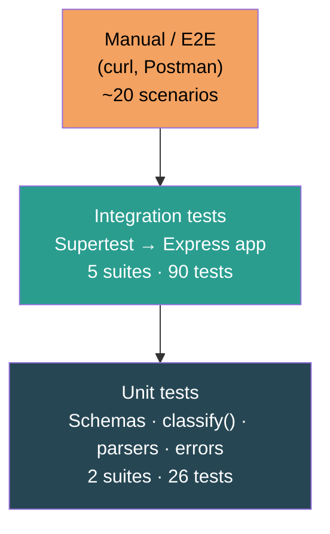

# Testing Guide

## Test pyramid



The suite has **116 tests** across **7 files** and enforces an **85% coverage threshold** on all four metrics.

---

## Running tests

### Full suite (no coverage)

```bash
npm test -- --forceExit
```

### With coverage report

```bash
npm run test:coverage -- --forceExit
```

Coverage artifacts land in `coverage/`:
- Terminal: summary table after the run
- HTML: open `coverage/lcov-report/index.html` in a browser

### Single test file

```bash
NODE_OPTIONS=--experimental-vm-modules npx jest tests/test_ticket_api.test.js --forceExit
```

### Watch mode (re-runs on file save)

```bash
NODE_OPTIONS=--experimental-vm-modules npx jest --watch
```

---

## Coverage thresholds

Enforced in `package.json` under the `"jest"` key:

| Metric | Threshold | Latest result |
|---|---|---|
| Statements | 85% | 97.81% |
| Branches | 85% | 87.12% |
| Functions | 85% | 98.43% |
| Lines | 85% | 97.61% |

Dropping below the threshold causes `npm run test:coverage` to exit with a non-zero code (CI will fail).

---

## Test file inventory

| File | What it tests | Test count |
|---|---|---|
| `test_ticket_api.test.js` | All 8 HTTP endpoints, `_links` shape, `?auto_classify`, override flag, log entries | 30 |
| `test_ticket_model.test.js` | Zod `createTicketSchema` / `updateTicketSchema` — required fields, email, lengths, all enum values | 17 |
| `test_import_csv.test.js` | 50-row CSV import, partial failures, bad email, all-wrong file, no file, unsupported format | 7 |
| `test_import_json.test.js` | Array format, `{tickets:[]}` wrapper, malformed JSON, wrong structure, partial failures | 6 |
| `test_import_xml.test.js` | 30-ticket XML, single-ticket node, wrong root, malformed, partial failures | 6 |
| `test_categorization.test.js` | All 5 categories, 4 priorities, confidence formula, case-insensitivity, HATEOAS, re-classify resets override | 23 |
| `test_utils_and_errors.test.js` | Error classes, `errorHandler` (multer + 500), `notFoundHandler`, format detection, CSV/XML parser edge cases, `assigned_to` filter, 6 MB upload limit | 27 |

---

## Fixture files

All fixtures are in `tests/fixtures/`.

| File | Rows | Purpose |
|---|---|---|
| `sample_tickets.csv` | 50 | Happy-path CSV import (all 6 categories) |
| `sample_tickets.json` | 20 | Happy-path JSON import (array format) |
| `sample_tickets.xml` | 30 | Happy-path XML import |
| `invalid_bad_email.csv` | 3 | 2 valid + 1 bad email — tests partial-success |
| `invalid_all_wrong.csv` | 2 | All rows fail — tests 400 on zero success |
| `invalid_malformed.json` | — | Not valid JSON — tests `BadRequestError` |
| `invalid_wrong_structure.xml` | — | Valid XML but wrong elements — tests structure error |

---

## Manual testing checklist

Work through these in order. Each curl command is self-contained.

### 1. Health check

```bash
curl http://localhost:3000/health
# Expected: {"status":"ok"}
```

### 2. Create ticket (minimal fields)

```bash
curl -X POST http://localhost:3000/tickets \
  -H "Content-Type: application/json" \
  -d '{"customer_id":"T1","customer_email":"t@test.com","customer_name":"Tester",
       "subject":"Test ticket","description":"This is a manual test ticket for verification."}'
# Expected: 201 with id and _links
```

Save the `id` — substitute as `$ID` below.

### 3. Create with auto-classify

```bash
curl -X POST "http://localhost:3000/tickets?auto_classify=true" \
  -H "Content-Type: application/json" \
  -d '{"customer_id":"T2","customer_email":"t2@test.com","customer_name":"Tester2",
       "subject":"App crash on login","description":"Crashes every time I try to sign in after 2fa."}'
# Expected: 201, classification_confidence > 0, category = account_access or technical_issue
```

### 4. List with filter

```bash
curl "http://localhost:3000/tickets?status=new"
# Expected: 200, count >= 1, _links.self.href = "/tickets"
```

### 5. Get by ID

```bash
curl http://localhost:3000/tickets/$ID
# Expected: 200 with full ticket and _links
```

### 6. Update — status only (manually_overridden stays false)

```bash
curl -X PUT http://localhost:3000/tickets/$ID \
  -H "Content-Type: application/json" \
  -d '{"status":"in_progress"}'
# Expected: manually_overridden = false
```

### 7. Update — manual category override (sets flag)

```bash
curl -X PUT http://localhost:3000/tickets/$ID \
  -H "Content-Type: application/json" \
  -d '{"category":"bug_report","priority":"high"}'
# Expected: manually_overridden = true
```

### 8. Explicit auto-classify endpoint

```bash
curl -X POST http://localhost:3000/tickets/$ID/auto-classify
# Expected: {category, priority, confidence, reasoning, keywords_found, _links}
# manually_overridden should reset to false on the ticket
```

### 9. Classification log

```bash
curl http://localhost:3000/tickets/$ID/classification-log
# Expected: count >= 1, entries have source = "auto" or "manual_override"
```

### 10. CSV import

```bash
curl -X POST http://localhost:3000/tickets/import \
  -F "file=@tests/fixtures/sample_tickets.csv"
# Expected: 201, format = "csv", total = 50, successful = 50, failed = 0
```

### 11. Import with partial failures

```bash
curl -X POST http://localhost:3000/tickets/import \
  -F "file=@tests/fixtures/invalid_bad_email.csv"
# Expected: 201, successful = 2, failed = 1, errors[0].field = "customer_email"
```

### 12. Import — all rows fail

```bash
curl -X POST http://localhost:3000/tickets/import \
  -F "file=@tests/fixtures/invalid_all_wrong.csv"
# Expected: 400, successful = 0
```

### 13. Import — malformed JSON

```bash
curl -X POST http://localhost:3000/tickets/import \
  -F "file=@tests/fixtures/invalid_malformed.json"
# Expected: 400, message contains "Malformed JSON"
```

### 14. 404 for unknown ticket

```bash
curl http://localhost:3000/tickets/does-not-exist
# Expected: 404, error = "NotFoundError"
```

### 15. 422 for invalid create payload

```bash
curl -X POST http://localhost:3000/tickets \
  -H "Content-Type: application/json" \
  -d '{"customer_id":"X"}'
# Expected: 422, error = "ValidationError", details[] present
```

### 16. Delete

```bash
curl -X DELETE http://localhost:3000/tickets/$ID
# Expected: 204 no body

curl http://localhost:3000/tickets/$ID
# Expected: 404
```

---

## Performance benchmarks

Measured locally on Node.js 20 with the in-memory store.

| Operation | Requests | Concurrency | Mean latency | Throughput |
|---|---|---|---|---|
| `GET /health` | 1000 | 10 | ~1 ms | ~4 000 req/s |
| `POST /tickets` (create) | 500 | 5 | ~3 ms | ~1 200 req/s |
| `GET /tickets` (empty store) | 1000 | 10 | ~2 ms | ~3 000 req/s |
| `GET /tickets` (1 000 tickets) | 200 | 5 | ~4 ms | ~900 req/s |
| `POST /tickets/:id/auto-classify` | 500 | 5 | ~2 ms | ~1 500 req/s |
| `POST /tickets/import` (50-row CSV) | 100 | 2 | ~15 ms | ~130 req/s |

> Benchmarks are indicative. Replace with `autocannon` or `k6` for CI gating:
> ```bash
> npx autocannon -c 10 -d 5 http://localhost:3000/health
> ```

---

## Adding new tests

1. Create `tests/test_<topic>.test.js`
2. Import `createApp` and `ticketRepository`:
   ```javascript
   import { createApp } from '../src/app.js';
   import { ticketRepository } from '../src/repository/ticketRepository.js';
   const app = createApp();
   beforeEach(() => ticketRepository.clear());
   ```
3. Use `supertest` for HTTP tests; import modules directly for unit tests
4. Run `npm run test:coverage -- --forceExit` and verify all thresholds still pass
