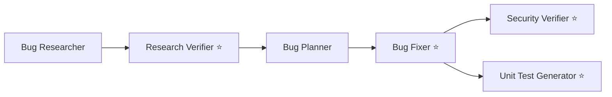

# Homework 4 — 4-Agent Bug / Security / Test Pipeline

**Author:** Denys Kubrakov <dkbeetroot@gmail.com>

A single-command **agent pipeline** that researches, verifies, plans, fixes, security-reviews,
and tests a small Node/Express + Tailwind **Notes** app which ships with intentionally seeded bugs
and security issues. Everything is self-contained in this folder and runs via `npm run pipeline`.

> Run instructions live in **[HOWTORUN.md](./HOWTORUN.md)**.

---

## Overview

The pipeline is six subagents dispatched **in run order** by `scripts/run-pipeline.sh`
(`npm run pipeline`). Each stage calls Claude Code headless (`claude -p`) naming the subagent to
use and, where required, the skill to load — so skills load automatically and there is **no manual
per-agent invocation** between steps.



The four **required** agents (Homework Tasks 1–4) are marked ⭐. The Bug Researcher and Bug Planner
are supporting stages that produce the inputs the required agents consume, so the whole run works
from one command.

### The sample app (Task 5)

A minimal Express JSON API (`/api/notes`) plus a Tailwind single page (`src/public/index.html`),
tested with Jest + supertest. It is seeded with two functional bugs and two security issues (see
[`context/bugs/001/bug-context.md`](./context/bugs/001/bug-context.md)):

| ID | Type | Where | Symptom |
|----|------|-------|---------|
| **BUG-1** | Missing 404 | `GET /api/notes/:id` | returns `200 null` for an unknown id |
| **BUG-2** | ID collision | `store.createNote` | `notes.length + 1` reuses a deleted id |
| **SECURITY-1** | Reflected XSS | `GET /api/notes/search` | `q` interpolated into HTML unescaped |
| **SECURITY-2** | Hardcoded secret + weak compare | `DELETE /api/notes/:id` | hardcoded token, loose `!=` |

---

## Per-agent model selection

Each agent declares an explicit `model:` in its frontmatter, chosen for its task: a **stronger
reasoning model (`opus`)** for verification/planning/security, and a **faster/cheaper model
(`sonnet`)** for high-volume scanning and mechanical edits/scaffolding.

| Agent | Model | Justification |
|-------|-------|---------------|
| `bug-researcher` | `sonnet` | High-volume codebase scanning; speed over deep reasoning. |
| `research-verifier` ⭐ | `opus` | Fact-checking every `file:line` claim is adversarial reasoning — must refuse fabricated references. |
| `bug-planner` | `opus` | Turning findings into correct before/after diffs is reasoning-heavy. |
| `bug-fixer` ⭐ | `sonnet` | The plan already contains before/after code; applying it is mechanical. |
| `security-verifier` ⭐ | `opus` | Spotting injection, unsafe comparisons, secrets, missing validation is the highest-stakes reasoning here. |
| `unit-test-generator` ⭐ | `sonnet` | Generating structured tests from a known diff is fast, well-bounded work. |

---

## Layout note — self-contained, single source of truth

Everything is inside `homework-4/`. The **real, runnable** agents and skills live in
`homework-4/.claude/`; there is **no root-level `.claude` and no duplicated copies**, so the files
that are committed are exactly the files that run — nothing can drift. The runner `cd`s into
`homework-4/` before invoking Claude Code, so `homework-4/.claude/` is discovered as the project
config.

The Homework spec names agents/skills with `*.agent.md` / flat `skills/*.md`; Claude Code actually
loads `.claude/agents/<name>.md` and `.claude/skills/<name>/SKILL.md`. Mapping:

| Spec name | Real path (this repo) |
|-----------|-----------------------|
| `agents/research-verifier.agent.md` | `.claude/agents/research-verifier.md` |
| `agents/bug-fixer.agent.md` | `.claude/agents/bug-fixer.md` |
| `agents/security-verifier.agent.md` | `.claude/agents/security-verifier.md` |
| `agents/unit-test-generator.agent.md` | `.claude/agents/unit-test-generator.md` |
| (support) | `.claude/agents/bug-researcher.md`, `.claude/agents/bug-planner.md` |
| `skills/research-quality-measurement.md` | `.claude/skills/research-quality-measurement/SKILL.md` |
| `skills/unit-tests-FIRST.md` | `.claude/skills/unit-tests-FIRST/SKILL.md` |

### Skills

- **`research-quality-measurement`** (Task 1.2) — a quality scale (VERIFIED / MOSTLY-VERIFIED /
  PARTIAL / UNRELIABLE), a scoring procedure, and the required sections of `verified-research.md`.
  The **Research Verifier** loads it.
- **`unit-tests-FIRST`** (Task 4.2) — the **FIRST** principles (Fast, Independent, Repeatable,
  Self-validating, Timely) with a checkable rule per letter and a pre-submit checklist. The
  **Unit Test Generator** loads it.

### Permissions

`homework-4/.claude/settings.json` allow-lists exactly the Bash commands the headless run needs
(`npm test`, `npm install`, `npm ls`, `npx jest`, `node`, `curl`) so the pipeline runs
non-interactively without a blanket bypass. A `PIPELINE_BYPASS=1` escape hatch is available — see
HOWTORUN.

---

## Before → after (what the pipeline produced)

The pipeline was run end-to-end (`npm run pipeline`). Outputs are in `context/bugs/001/`:

| Stage | Output doc | Result |
|-------|-----------|--------|
| Research Verifier ⭐ | [`research/verified-research.md`](./context/bugs/001/research/verified-research.md) | **PASS — Research Quality: VERIFIED (4/4 claims, 1.00)** |
| Bug Fixer ⭐ | [`fix-summary.md`](./context/bugs/001/fix-summary.md) | all fixes applied; changed files: `src/routes/notes.js`, `src/store.js` |
| Security Verifier ⭐ | [`security-report.md`](./context/bugs/001/security-report.md) | **0 CRITICAL / 0 HIGH**; seeded vulns confirmed fixed; found 1 extra MEDIUM (see below) |
| Unit Test Generator ⭐ | [`test-report.md`](./context/bugs/001/test-report.md) + [`tests/notes.fixed.test.js`](./tests/notes.fixed.test.js) | 6 FIRST regression tests |
| (support) | [`research/codebase-research.md`](./context/bugs/001/research/codebase-research.md), [`implementation-plan.md`](./context/bugs/001/implementation-plan.md) | inputs to the required agents |

**Fixes applied to source:**

| ID | Fix |
|----|-----|
| BUG-1 | `GET /api/notes/:id` returns `404 { error: 'not found' }` for an unknown id. |
| BUG-2 | `store.js` uses a monotonic `nextId` counter, so a deleted id is never reissued. |
| SECURITY-1 | `escapeHtml()` escapes `q` and note fields before HTML interpolation. |
| SECURITY-2 | Admin token read from `process.env.ADMIN_TOKEN`; compared with `crypto.timingSafeEqual`. |

**Final test suite: 10/10 passing** (4 baseline in `tests/notes.test.js` + 6 new in
`tests/notes.fixed.test.js`).

### Residual finding (pipeline did more than the seed)

The Security Verifier surfaced a genuine **[MEDIUM]** issue beyond the seeded four: `POST /api/notes`
validates only `!title` (truthiness), so a non-string `title`/`body` is stored and later throws in
`/search` (`.includes` on a non-string) — a stored denial-of-service. It is documented in
[`security-report.md`](./context/bugs/001/security-report.md) as accepted residual risk for this
homework iteration; the remediation (a one-line type guard) is noted there.

---

## Repository structure

```
homework-4/
├── README.md                      # this file
├── HOWTORUN.md                    # how to run app / pipeline / tests
├── PROMPTS.md                     # Context → Model → Prompt for every build step
├── package.json                   # scripts: start, test, pipeline
├── scripts/run-pipeline.sh        # single-command pipeline runner
├── .claude/
│   ├── settings.json              # scoped Bash allow-list for the headless run
│   ├── agents/                    # 6 runnable subagents (explicit model each)
│   └── skills/
│       ├── research-quality-measurement/SKILL.md
│       └── unit-tests-FIRST/SKILL.md
├── src/                           # Express app + Tailwind UI (fixed code)
├── tests/                         # notes.test.js (baseline) + notes.fixed.test.js (generated)
├── context/bugs/001/              # bug-context + all pipeline input/output docs
└── docs/screenshots/              # submission screenshots (see below)
```

---

## Screenshots

Screenshots for the PR live in [`docs/screenshots/`](./docs/screenshots/):

- **pipeline run** — `npm run pipeline` stage banners through "Pipeline complete".
- **fixes** — the four defects reproduced (curl) before, then resolved after.
- **security scan** — the Security Verifier's `security-report.md` summary.
- **unit tests** — `npm test` showing 10/10 passing (baseline + generated).

See HOWTORUN for the exact commands each screenshot should capture.
